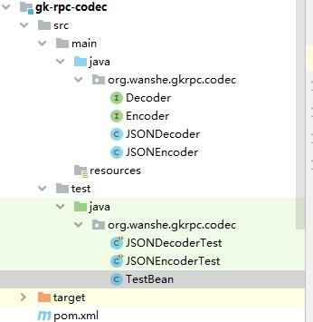

# 第一个项目-RPC框架

https://www.imooc.com/learn/1158  慕课网

2022/4/23 第一次真正的开始写项目，带着学习的目的。

之前跟着 B站 写过一个 SpringBoot + MybatisPlus 的项目，但是只是复制了一下代码，没有学过 Spring 和 SpringBoot，所以不算，现在正式开始自己搭项目。先入门，搞明白项目是什么，该怎么搭。而不是囫囵吞枣。


## 理论

RPC：Remote Procedure Call ，远程过程调用（有返回值的是function，无返回值的是procedure）

是分布式系统常用通信方式。


跨进程交互方式：WebService，HTTP，基于MQ的数据交换，RPC，基于DB的数据交换，RESTful

1、依赖中间件做数据交互：应用于异步执行，相互不影响，允许数据消息挤压：A 放数据到中间件，B 从中间件获取数据执行

MySQL，RabbitMQ，Kafka，Redis

2、直接交互：（服务端和客户端），同步执行，服务端的处理速度直接影响到客户端，等待响应，对速度要求高。

RESTful，WebService，RPC，HTTP


RPC：

Service：Provider（服务提供者）

Client：Consumer（服务消费者）

Stub：存根（服务描述）


RPC 的优势：可以像调用本地方法一样调用远程方法。


|          | gRPC（google） | thrift（facebook） | RMI（jdk）  | dubbo（阿里） | HadoopRPC（hadoop） |
| -------- | -------------- | ------------------ | ----------- | ------------- | ------------------- |
| 开发语言 | 多语言         | 多语言             | Java        | Java          | Java                |
| 序列化   | protobuf       | thrift 格式        | Java 序列化 | hession2      | R/Writable          |
| 注册中心 | ❌              | ❌                  | jdk 自带    | Zk 等         | ❌                   |
| 跨语言   | ✔              | ✔                  | ❌           | ❌             | ❌                   |
| 服务定义 | protobuf 文件  | thrift 文件        | Java 接口   | Java 接口     | Java 接口           |
| 服务治理 | ❌              | ❌                  | ❌           | ✔             | ❌                   |


原理（架构）：


* 服务提供者在注册中心注册服务
* 服务消费者在注册中心订阅服务
* 注册中心返回服务信息（服务信息和地址，尤其是修改服务信息和地址的时候可以持久化的通知给服务消费者）
* 服务消费者调用服务提供者的服务

注意：call 是核心功能，其他都是辅助功能。完全可以直接将服务信息写死在 Client 中。


* Client 调用远程方法
* 调用存根
* 将传输数据序列化为二进制数据
* 通过网络传输到远程端
* 将数据反序列化
* 查找对应存根，找到对应对象实例（单例）
* 通过反射调用对象方法
* 将方法返回值序列化
* 通过网络传输到 Client 端
* 数据反序列化并返回
* 调用完成

：网络模块，序列化模块，存根代理模块（Client stub），服务管理模块（server stub：查找，反射）


技术栈：

JavaCore， Maven，反射，动态代理（生成 client 存根实际调用对象）（jdk，asm，java assist），序列化，网络通信

：jdk 动态代理具有一定局限性（只能动态代理接口，而其他的可以动态生成 class）

：使用 fastjson，字符串可以说就是二进制数据

：使用HTTP，服务端使用 jetty、客户端使用 jdk-URLConnection（使用 HTTP 而不是 TCP长连接 优势是比较简单，可以直接使用 HTTP 服务不必多开端口，但是 TCP长连接才是 RPC 的主流）


## 实战


### 创建工程


#### 类图


* 如何画类图：Visio 选择 UML类图

* 如何画带箭头直连线：

  

选择线条后通过连接点连接即可，想要带箭头只要右击线条修改线条箭头即可。

* UML 类图如何删除类中成员（直接选中 ctrl + z）


#### 创建工程

使用 IDEA 创建工程，多模块管理


* gk-rpc-client 客户端模块
* gk-rpc-codec 序列化模块
* gk-rpc-common  工具模块
* gk-rpc-proto  协议模块
* gk-rpc-server 服务端模块
* gk-rpc-transport 网络模块


#### 配置依赖

在主 POM 中配置依赖

```xml
<?xml version="1.0" encoding="UTF-8"?>
<project xmlns="http://maven.apache.org/POM/4.0.0"
         xmlns:xsi="http://www.w3.org/2001/XMLSchema-instance"
         xsi:schemaLocation="http://maven.apache.org/POM/4.0.0 http://maven.apache.org/xsd/maven-4.0.0.xsd">
    <modelVersion>4.0.0</modelVersion>

    <groupId>org.wanshe</groupId>
    <artifactId>gk-rpc</artifactId>
    <packaging>pom</packaging>
    <version>1.0-SNAPSHOT</version>
    <modules>
        <module>gk-rpc-client</module>
        <module>gk-rpc-server</module>
        <module>gk-rpc-codec</module>
        <module>gk-rpc-common</module>
        <module>gk-rpc-proto</module>
        <module>gk-rpc-transport</module>
    </modules>

    <properties>
        <maven.compiler.source>8</maven.compiler.source>
        <maven.compiler.target>8</maven.compiler.target>

        <commons.version>2.5</commons.version>
        <jetty.version>9.4.19.v20190610</jetty.version>
        <fastjson.version>1.2.44</fastjson.version>
        <junit.version>4.12</junit.version>
        <lombok.version>1.18.8</lombok.version>
        <slf4j.version>1.7.26</slf4j.version>
        <logback.version>1.2.3</logback.version>
    </properties>

    <dependencyManagement><!-- 子模块可能用到的依赖-->
        <dependencies>
            <dependency>
                <groupId>commons-io</groupId>
                <artifactId>commons-io</artifactId>
                <version>${commons.version}</version>
            </dependency>
            <dependency>
                <groupId>org.eclipse.jetty</groupId>
                <artifactId>jetty-servlet</artifactId>
                <version>${jetty.version}</version>
            </dependency>
            <dependency>
                <groupId>com.alibaba</groupId>
                <artifactId>fastjson</artifactId>
                <version>${fastjson.version}</version>
            </dependency>
        </dependencies>
    </dependencyManagement>

    <dependencies> <!-- 公用依赖-->
        <dependency>
            <groupId>junit</groupId> <!-- 单元测试-->
            <artifactId>junit</artifactId>
            <version>${junit.version}</version>
            <!-- <scope>test</scope> -->
        </dependency>
        <dependency>
            <groupId>org.projectlombok</groupId>
            <artifactId>lombok</artifactId>
            <version>${lombok.version}</version>
        </dependency>
        <dependency>
            <groupId>org.slf4j</groupId><!-- 日志-->
            <artifactId>slf4j-api</artifactId>
            <version>${slf4j.version}</version>
        </dependency>
        <dependency>
            <groupId>ch.qos.logback</groupId><!-- 日志实现-->
            <artifactId>logback-classic</artifactId>
            <version>${logback.version}</version>
        </dependency>
    </dependencies>

    <build>
        <plugins>
            <plugin>
                <groupId>org.apache.maven.plugins</groupId>
                <artifactId>maven-compiler-plugin</artifactId>
                <version>3.8.1</version>
                <configuration>
                    <source>${maven.compiler.source}</source>
                    <target>${maven.compiler.target}</target>
                </configuration>
            </plugin>
        </plugins>
    </build>

</project>
```

启用 Lombok 后需要先下载 Lombok 插件，然后在注解处理器中勾选 启用注解处理。


### IEAD Git

* 头部选项栏中 点击 VCS ，点击创建 Git 仓库
* 右击项目 package，选择 Git，选择提交选项（add）
* 然后继续 提交（commit）
* 在终端 或者 头部选项栏的 Git 中添加远程仓库，并 push

```sh
git remote add gitee https://gitee.com/wanshes/gk-rpc.git
git push -u gitee main
```


一些问题：

* push 的时候输入的是 master，就显示失败，用 main 就成功，不知道为什么
* 通过头部栏添加经常会失败，用命令行靠谱
* 如果是已有仓库，需要先 pull，再push
* 在本地修改与远程代码无冲突的情况下，优先使用：pull->[commit](https://so.csdn.net/so/search?q=commit&spm=1001.2101.3001.7020)->push
* 在本地修改与远程代码有冲突的情况下，优先使用：commit->pull->push


### 指定协议

协议模块：proto，新建软件包（org.wanshe.gkrpc)

根据类图，协议模块有3个类：

* ServiceDescriptor：服务
* Request：RPC请求
* Response：RPC响应

我们新加一个类 - Peer：端点

结构图：


Lombok：

* @Data 自动配置 set，get 方法
* @AllArgsConstructor 自动配置全参构造方法
* @NoArgsConstructor 自动配置无参构造方法

#### Peer

```java
/**
 * 表示网络传输的一个端点
 *
 * @author wanshe
 */
@Data
@AllArgsConstructor
public class Peer {
    private String host;
    private int port;
}
```


#### ServiceDescriptor

```java
/**
 * 表示服务
 *
 * @author wanshe
 */
@Data
@AllArgsConstructor
@NoArgsConstructor
public class ServiceDescriptor {
    private String clazz;
    private String method;
    private String returnType;
    private String[] parameterTypes;
}
```


#### Request

```java
/**
 * 表示一个RPC请求
 *
 * @author wanshe
 */
@Data
public class Request {
    private ServiceDescriptor service;
    private Object[] parameters;
}
```


#### Response

```java
/**
 * 表示一个RPC响应
 *
 * @author wanshe
 */
@Data
public class Response {
    /**
     * 状态码：0-成功：非0-失败
     */
    private int code = 0;
    /**
     * 状态描述信息
     */
    private String message = "ok";
    /**
     * 返回数据
     */
    private Object data;
}
```


### 通用工具

实现反射工具类

#### ReflectionUtils

* newInstance()：获取对象
* getPublicMethods()：获取公共方法
* invoke()：执行方法获取返回值

```java
/**
 * 反射工具类
 *
 * @author wanshe
 */
public class ReflectionUtils {
    /**
     * 根据Class创建对象
     *
     * @param clazz 待创建对象类
     * @param <T> 对象类型
     * @return 创建好的对象
     */
    public static <T> T newInstance(Class<T> clazz) {
        try {
            return clazz.newInstance();
        } catch (Exception e) {
            throw new IllegalStateException(e);
        }
    }

    /**
     * 获取某个class的公共方法
     *
     * @param clazz 对象类
     * @return class的公共方法
     */
    public static Method[] getPublicMethods(Class clazz) {
        Method[] methods = clazz.getDeclaredMethods();
        List<Method> pMethods = new ArrayList<>();
        for (Method m :methods) {
            if (Modifier.isPublic(m.getModifiers())) {
                pMethods.add(m);
            }
        }
        return pMethods.toArray(new Method[0]);
    }

    /**
     * 调用指定对象的指定方法
     * @param obj 调用对象
     * @param method 调用方法
     * @param args 方法参数
     * @return 返回结果
     */
    public static Object invoke(Object obj, Method method, Object... args) {
        try {
            return method.invoke(obj, args);
        } catch (Exception e) {
            throw new IllegalStateException(e);
        }
    }

}
```


#### 单元测试

* 在代码块上按下 ctrl + shift + t 
* 弹出新建测试模块，选中后新建一个测试类
* 将三个方法全部选中，选中测试工具为 junit4。
* 新建测试类 TestClass

```java
/**
 * @author wanshe
 */
public class TestClass {
    private String pri() {
        return "private";
    }

    public String pub() {
        return "public";
    }

    protected String pro() {
        return "protected";
    }
}
```

* 在单元测试中挨个测试方法

```java
/**
 * @author wanshe
 */
public class ReflectionUtilsTest {

    @Test
    public void newInstance() {
        TestClass t = ReflectionUtils.newInstance(TestClass.class);
        assertNotNull(t);
    }

    @Test
    public void getPublicMethods() {
        Method[] methods = ReflectionUtils.getPublicMethods(TestClass.class);
        assertEquals(1, methods.length);

        String mName = methods[0].getName();
        assertEquals("pub", mName);
    }

    @Test
    public void invoke() {
        Method[] methods = ReflectionUtils.getPublicMethods(TestClass.class);
        Method pub = methods[0];

        TestClass t = new TestClass();
        Object r = ReflectionUtils.invoke(t, pub);
        assertEquals("public", r);
    }
}
```


### 实现序列化模块

序列化模块有2个类，两个接口：

* Encoder
* Decoder
* JSONEncoder
* JSONDecoder

基于 fastjson 完成

在模块中引入 fastjson 依赖

```xml
    <dependencies>
        <dependency>
            <groupId>com.alibaba</groupId>
            <artifactId>fastjson</artifactId>
        </dependency>
    </dependencies>
```


#### Encoder

```java
/**
 * 序列化
 *
 * @author wanshe
 */
public interface Encoder {
    byte[] encode(Object obj);
}
```


#### Decoder

```java
/**
 * 反序列化
 *
 * @author wanshe
 */
public interface Decoder {
    <T> T decode(byte[] bytes, Class<T> clazz);
}
```


#### JSONEncoder

```java
/**
 * 基于JSON的序列化实现
 *
 * @author wanshe
 */
public class JSONEncoder implements Encoder {
    @Override
    public byte[] encode(Object obj) {
        return JSON.toJSONBytes(obj);
    }
}
```


#### JSONDecoder

```java
/**
 * 基于JSON的反序列化实现
 *
 * @author wanshe
 */
public class JSONDecoder implements Decoder {

    @Override
    public <T> T decode(byte[] bytes, Class<T> clazz) {
        return JSON.parseObject(bytes, clazz);
    }
}
```


#### 单元测试

* 创建 TestBean 类

```java
/**
 * @author wanshe
 */
@Data
public class TestBean {
    private String name;
    private int age;
}
```

* 测试 JSONEncoder

```java
/**
 * @author wanshe
 */
public class JSONEncoderTest {

    @Test
    public void encode() {
        Encoder encoder = new JSONEncoder();
        TestBean bean = new TestBean();
        bean.setName("wanshe");
        bean.setAge(18);

        byte[] bytes = encoder.encode(bean);
        assertNotNull(bytes);
    }
}
```

* 测试JSONDecoder

```java
/**
 * @author wanshe
 */
public class JSONDecoderTest {

    @Test
    public void decode() {
        Encoder encoder = new JSONEncoder();
        TestBean bean = new TestBean();
        bean.setName("wanshe");
        bean.setAge(18);

        byte[] bytes = encoder.encode(bean);

        Decoder decoder = new JSONDecoder();
        TestBean bean1 = decoder.decode(bytes, TestBean.class);
        assertEquals("wanshe", bean1.getName());
        assertEquals(18, bean1.getAge());
    }
}
```

结构图：




### 实现网络模块

网络模块有三个接口和两个类

* RequestHandler：处理网络请求的handler
* TransportClient：客户端
* TransportServer：服务端
* HTTPTransportClient：基于HTTP实现的客户端
* HTTPTransportServer：基于HTTP实现的服务端


#### 配置依赖

* common-io
* jetty
* gkrpc-proto

```xml
    <dependencies>
        <dependency>
            <groupId>commons-io</groupId>
            <artifactId>commons-io</artifactId>
        </dependency>
        <dependency>
            <groupId>org.eclipse.jetty</groupId>
            <artifactId>jetty-servlet</artifactId>
        </dependency>
        <dependency>
            <groupId>org.wanshe</groupId>
            <artifactId>gk-rpc-proto</artifactId>
            <version>${project.version}</version>
        </dependency>
    </dependencies>
```


#### RequestHandler

```java
/**
 * 处理网络请求的handler
 *
 * @author wanshe
 */
public interface RequestHandler {
    void onRequest(InputStream receive, OutputStream toResponse);
}
```


#### TransportClient

```java
/**
 * 1、创建连接
 * 2、发送数据，等待响应
 * 3、关闭连接
 *
 * @author wanshe
 */
public interface TransportClient {
    void connect(Peer peer);

    InputStream write(InputStream data);

    void close();
}
```


#### TransportServer

```java
/**
 * 1、启动，监听端口
 * 2、接收处理请求
 * 3、关闭监听
 *
 * @author wanshe
 */
public interface TransportServer {
    void init(int port, RequestHandler handler);

    void start();

    void stop();
}
```


#### HTTPTransportClient

```java
/**
 * 基于HTTP实现的客户端
 *
 * @author wanshe
 */
public class HTTPTransportClient implements TransportClient {
    private String url;

    @Override
    public void connect(Peer peer) {
        this.url = "http://" + peer.getHost() + ":" + peer.getPort();
    }

    @Override
    public InputStream write(InputStream data) {
        try {
            HttpURLConnection httpConn = (HttpURLConnection) new URL(url).openConnection();
            httpConn.setDoOutput(true);
            httpConn.setDoInput(true);
            httpConn.setUseCaches(false);
            httpConn.setRequestMethod("POST");

            httpConn.connect();
            IOUtils.copy(data, httpConn.getOutputStream());

            int resultCode = httpConn.getResponseCode();
            if (resultCode == HttpURLConnection.HTTP_OK) {
                return httpConn.getInputStream();
            } else {
                return httpConn.getErrorStream();
            }
        } catch (IOException e) {
            throw new IllegalStateException(e);
        }

    }

    @Override
    public void close() {

    }
}
```


#### HTTPTransportServer

* Lombok @Slf4j 注解自动配置 log

```java
/**
 * 基于HTTP实现客户端
 *
 * @author wanshe
 */
@Slf4j
public class HTTPTransportServer implements TransportServer {
    private RequestHandler handler;
    private Server server;

    @Override
    public void init(int port, RequestHandler handler) {
        this.handler = handler;
        this.server = new Server(port);

        // servlet 接收请求
        ServletContextHandler ctx = new ServletContextHandler();
        server.setHandler(ctx);

        ServletHolder holder = new ServletHolder(new RequestServlet());
        ctx.addServlet(holder, "/*");
    }

    @Override
    public void start() {
        try {
            server.start();
            server.join();
        } catch (Exception e) {
            log.error(e.getMessage(), e);
        }
    }

    @Override
    public void stop() {
        try {
            server.stop();
        } catch (Exception e) {
            log.error(e.getMessage(), e);
        }
    }

    class RequestServlet extends HttpServlet {
        @Override
        protected void doPost(HttpServletRequest req, HttpServletResponse resp) throws ServletException, IOException {
            log.info("client connect");

            InputStream in = req.getInputStream();
            OutputStream out = resp.getOutputStream();

            if (handler != null) {
                handler.onRequest(in, out);
            }

            out.flush();
        }
    }
}
```

结构图：


### 实现 Server 模块

Server 模块有五个实现类：

* ServiceInstance：服务实现类，表示一个服务
* ServiceManager：服务管理类，管理RPC服务
* RpcServerConfig：RPC服务器的配置类
* ServiceInvoker：服务调用类
* RpcServer：服务器类


#### 配置依赖

```xml
    <dependencies>
        <dependency>
            <groupId>org.wanshe</groupId>
            <artifactId>gk-rpc-proto</artifactId>
            <version>${project.version}</version>
        </dependency>
        <dependency>
            <groupId>org.wanshe</groupId>
            <artifactId>gk-rpc-codec</artifactId>
            <version>${project.version}</version>
        </dependency>
        <dependency>
            <groupId>org.wanshe</groupId>
            <artifactId>gk-rpc-common</artifactId>
            <version>${project.version}</version>
        </dependency>
        <dependency>
            <groupId>org.wanshe</groupId>
            <artifactId>gk-rpc-transport</artifactId>
            <version>${project.version}</version>
        </dependency>
        <dependency>
            <groupId>commons-io</groupId>
            <artifactId>commons-io</artifactId>
        </dependency>
    </dependencies>
```


#### ServiceDescriptor

重写 proto 中 ServiceDescriptor 方法

* form（）：获取一个ServiceDescriptor对象
* hashCode（）：为 Map 服务
* equals（）：为 Map 服务
* toString（）：为 hashCode 服务

注意：重写之前先注释掉 @Data，然后按下 ctrl + o 即可。

```java
/**
 * 表示服务
 *
 * @author wanshe
 */
@Data
@AllArgsConstructor
@NoArgsConstructor
public class ServiceDescriptor {
    private String clazz;
    private String method;
    private String returnType;
    private String[] parameterTypes;

    public static ServiceDescriptor from(Class<?> clazz, Method method) {
        ServiceDescriptor sdp = new ServiceDescriptor();
        sdp.setClazz(clazz.getName());
        sdp.setMethod(method.getName());
        sdp.setReturnType(method.getReturnType().getName());

        Class<?>[] parameterClasses = method.getParameterTypes();
        String[] parameterTypes = new String[parameterClasses.length];
        for (int i = 0; i < parameterClasses.length; ++ i) {
            parameterTypes[i] = parameterClasses[i].getName();
        }
        sdp.setParameterTypes(parameterTypes);

        return sdp;
    }

    @Override
    public int hashCode() {
//        return super.hashCode();
        return toString().hashCode();
    }

    @Override
    public boolean equals(Object obj) {
//        return super.equals(obj);
        if (this == obj)    return true;
        if (obj == null || getClass() != obj.getClass())    return false;

        ServiceDescriptor that = (ServiceDescriptor) obj;
        return this.toString().equals(that.toString());
    }

    @Override
    public String toString() {
//        return super.toString();
        return "clazz=" + clazz
                + ",method=" + method
                + ",returnType=" + returnType
                + ",parameterTypes=" + Arrays.toString(parameterTypes);
    }
}
```


#### ServiceInstance

```java
/**
 * 表示一个具体服务
 *
 * @author wanshe
 */
@Data
@AllArgsConstructor
public class ServiceInstance {
    private Object target;
    private Method method;
}
```


#### ServiceManager

```java
/**
 * 管理RPC暴露的服务
 *
 * @author wanshe
 */
@Slf4j
public class ServiceManager {
    private Map<ServiceDescriptor, ServiceInstance> service;

    public ServiceManager() {
        this.service = new ConcurrentHashMap<>();
    }

    public <T> void register(Class<T> interfaceClass, T bean) {
        Method[] methods = ReflectionUtils.getPublicMethods(interfaceClass);
        for (Method method : methods) {
            ServiceInstance sis = new ServiceInstance(bean, method);
            ServiceDescriptor sdp = ServiceDescriptor.from(interfaceClass, method);

            service.put(sdp, sis);
            log.info("register service : {} {}", sdp.getClazz(), sdp.getMethod());
        }
    }

    public ServiceInstance lookup(Request request) {
        ServiceDescriptor sdp = request.getService();
        return service.get(sdp);
    }
}
```


#### RpcServerConfig

```java
/**
 * server 配置
 *
 * @author wanshe
 */
@Data
public class RpcServerConfig {
    private Class<? extends TransportServer> transportClass = HTTPTransportServer.class;
    private Class<? extends Encoder> encoderClass = JSONEncoder.class;
    private Class<? extends Decoder> decoderClass = JSONDecoder.class;
    private int port = 4573;

}
```


#### ServiceInvoker

```java
/**
 * 调用具体服务
 *
 * @author wanshe
 */
public class ServiceInvoker {
    public Object invoke(ServiceInstance service, Request request) {
        return ReflectionUtils.invoke(
                service.getTarget(),
                service.getMethod(),
                request.getParameters()
        );
    }
}
```


#### RpcServer

```java
/**
 * @author wanshe
 */
@Slf4j
public class RpcServer {
    private RpcServerConfig config;
    private TransportServer net;
    private Encoder encoder;
    private Decoder decoder;
    private ServiceManager serviceManager;
    private ServiceInvoker serviceInvoker;

    public RpcServer() {
        this(new RpcServerConfig());
    }

    public RpcServer(RpcServerConfig config) {
        this.config = config;

        // net
        this.net = ReflectionUtils.newInstance(config.getTransportClass());
        this.net.init(config.getPort(), this.handler);

        // codec
        this.encoder = ReflectionUtils.newInstance(config.getEncoderClass());
        this.decoder = ReflectionUtils.newInstance(config.getDecoderClass());

        // service
        this.serviceManager = new ServiceManager();
        this.serviceInvoker = new ServiceInvoker();
    }

    public <T> void register(Class<T> interfaceClass, T bean) {
        serviceManager.register(interfaceClass, bean);
    }

    public void start() {
        this.net.start();
    }

    public void stop() {
        this.net.stop();
    }

    private RequestHandler handler = new RequestHandler() {
        @Override
        public void onRequest(InputStream receive, OutputStream toResponse) {
            Response resp = new Response();

            try {
                byte[] inBytes = IOUtils.readFully(receive, receive.available());
                Request request = decoder.decode(inBytes, Request.class);

                log.info("get request: {}", request);

                ServiceInstance sis = serviceManager.lookup(request);
                Object ret = serviceInvoker.invoke(sis, request);
                resp.setData(ret);
            } catch (IOException e) {
                log.warn(e.getMessage(), e);
                resp.setCode(1);
                resp.setMessage("RpcServer got error: "
                        + e.getClass().getName()
                        + " : " + e.getMessage());
            } finally {
                try {
                    byte[] outBytes = encoder.encode(resp);
                    toResponse.write(outBytes);

                    log.info("response client");
                } catch (IOException e) {
                    log.warn(e.getMessage(), e);
                }
            }
        }
    };
}
```


#### 单元测试

* 新建接口

```java
/**
 * @author wanshe
 */
public interface TestInterface {
    void todo();
}
```

* 继承接口

```java
/**
 * @author wanshe
 */
public class TestClass implements TestInterface {

    @Override
    public void todo() {

    }
}
```

* 测试

```java
/**
 * @author wanshe
 */
public class ServiceManagerTest {
    ServiceManager sm;

    @Before //在测试之前执行
    public void init() {
        sm = new ServiceManager();
    }

    @Test
    public void register() {
        TestInterface bean = new TestClass();
        sm.register(TestInterface.class, bean);
    }

    @Test
    public void lookup() {
        TestInterface bean = new TestClass();
        sm.register(TestInterface.class, bean);

        Method[] methods = ReflectionUtils.getPublicMethods(TestInterface.class);
        assertEquals(methods.length, 1);
        assertEquals(methods[0].getName(), "todo");
        ServiceDescriptor sdp = ServiceDescriptor.from(TestInterface.class, methods[0]);

        Request request = new Request();
        request.setService(sdp);

        ServiceInstance sis = sm.lookup(request);
        assertNotNull(sis);
    }
}
```

结构图：


### 实现 Client 模块

Client模块由一个接口和四个类组成

* 突然发现大可不必，直接 git 即可。


### 文档

* proto：协议模块，定义传输数据的结构（格式）：定义了服务器端点Peer，服务描述ServiceDescriptor，请求Request，响应Response
  * Peer：具有两个属性：host，port
  * ServiceDescriptor：具有四个属性：clazz，method，returnType，parameterTypes
  * Request：具有两个属性：ServiceDescriptor，otherObject
  * response：三个属性：code，message，data

* codec：序列化模块，使用基于 fastjson 实现的序列化和反序列化方法

* common：工具模块，定义了反射工具类 ReflectionUtils,实现代码复用

  * newInstance 方法：获取对象实例

  newInstance 和 new 区别在于创建对象的方式不同：

  也就是 new 创建对象有两步，先加载class，再实例化，那么对于 newInstance，只有实例化这一步

  所以使用 newInstance 时必须保证：这个类已经被加载并且连接

  那么 newInstance 的好处是什么：将步骤分开，可以实现解耦，提高灵活性，可以在运行期变更。

  * getPublicMethods：获取公共方法
  * invoke：调用指定对象的指定方法

* transport：网络模块，实现网络通信

  * TransportServer 接口：服务端端口（1、开启监听 2、接收请求，返回响应 3、关闭监听）
  * RequestHandler 接口：处理请求（传入请求，返回响应）
  * HTTPTransportServer ：使用 jetty 实现服务端，处理 HTTP 请求
  * TransportClient 接口：客户端端口（1、连接 2、发送请求  3、关闭连接）
  * HTTPTransportClient ：使用 jdk URLConnection 实现，发送 HTTP 请求并获取响应信息

* server：服务器模块

  * ServiceInstance：服务实例（对象 + 方法）
  * ServiceInvoker：反射调用服务
  * RpcServerConfig：配置信息（端口，序列化，反序列化，网络传输）
  * ServiceManager：服务管理器（通过 Map<ServiceDescripter, ServiceInstance> 实现）
  * RpcServer：服务器（整合管理端口，注册服务，处理请求）

* client：客户端模块

  * TransportSelector 接口 ：连接选择器，管理连接
  * RandomTransportSelector：通过 Random 随机化实现
  * RpcClientConfig：客户端的配置信息（远程端口，连接数，网络传输，序列化，反序列化，连接选择器）
  * RemoteInvoker：实现远程调用，使用 jdk 动态代理
  * RpcClient：服务端（整合管理端口，发送请求，返回服务）


* jetty 嵌入
* 动态代理
  * 当使用动态代理对象调用方法时，会自动调用 invoke，传入方法名和参数
* 不足
  * 没有信息校验，没有序列化加密，没有身份验证
  * 服务端处理能力，jetty具有一定不足
  * 注册中心
  * 集成，构建 starter


### 单词表

* parse：解析
* instance：实例
* parameter：参数
* protocol：协议
* modifier：修饰符
* declare：声明
* invoke：调用
* handler：处理者
* servlet：服务层
* holder：持有者
* remote：远程
* proxy：代理

